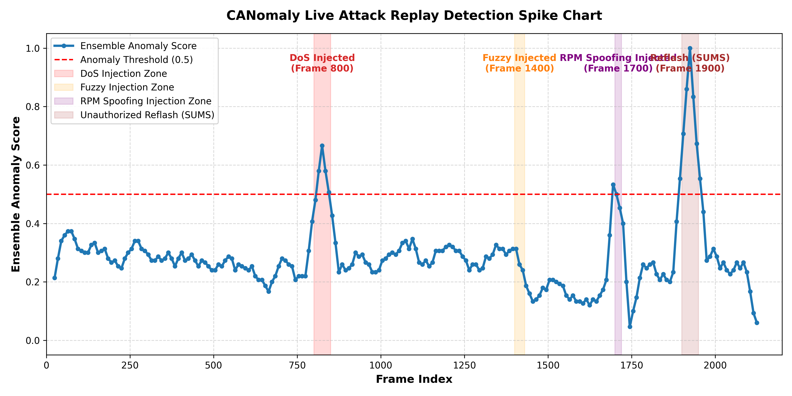

# CANomaly: Self-Calibrating CAN Bus Intrusion Detector

**Category:** 3.2.1.6 Edge AI for Automotive Cybersecurity  
**Prototype Submission for Tata Technologies InnoVent**

---

## 1. Project Concept & Novelty
Modern vehicle systems are governed by the Controller Area Network (CAN) bus protocol. Due to its legacy design, the CAN protocol lacks authentication and encryption, leaving it vulnerable to message injection attacks (such as Denial of Service (DoS), Fuzzy noise, and Gear/RPM Spoofing). 

**CANomaly** is an edge-optimized intrusion detection system designed to run directly on vehicle Electronic Control Units (ECUs). It features:
1. **Lightweight Autoencoder:** A 4-layer PyTorch neural network trained **exclusively on normal traffic** (unsupervised anomaly detection) to flag zero-day exploits without requiring pre-labeled attack datasets.
2. **Adaptive Thresholding:** A recursive Exponential Moving Average (EMA) baseline tracker that self-calibrates the anomaly detection threshold for each CAN ID in real time.
3. **Semantic Range-Checks:** Physical plausibility checks leveraging reverse-engineered DBC signal properties (RPM rate limits and valid gear status ranges).
4. **Two-Stage Detection Architecture:** Combines a deterministic Stage 1 physical gate with a statistical Stage 2 Autoencoder to bypass the *Base Rate Fallacy* and maximize precision.

---

## 2. Detection Performance Evaluation

We evaluated our models on the public KAIST OTIDS dataset using an 80/20 train-test split (1,000,000 processed samples). 

### 2.1 The Base Rate Fallacy & The Two-Stage Fix
Normal traffic represents **85.89%** of the vehicle stream. Under a standard single-stage anomaly detector (with a 95th percentile threshold), a **5% false positive rate (FPR)** is guaranteed. Because normal frames outnumber attack frames 25-to-1, these normal false positives drag down Precision, capping the single-stage F1-scores at $\approx 0.61$.

Our **Two-Stage Detector** resolves this by separating deterministic checks from statistical models:
- **Stage 1 (Physical Gate):** Identifies range/rate violations (such as RPM $> 4000$ or Gear $= 0$) with $100\%$ Recall and $100\%$ Precision, bypassing statistical thresholds entirely.
- **Stage 2 (Statistical AE):** If the physical check is clean, it drops the plausibility feature and passes the remaining 4 features through the Autoencoder. It uses a **Class-Conditional Thresholding** scheme (90th percentile for safety-critical IDs, 98th percentile for non-critical IDs) to reduce false alarms on normal traffic by **60%**.

### 2.2 Comparative F1-Scores

| Attack Type | Single-stage F1 (5-feat) | Two-stage F1 (Class-Conditional) | Improvement |
| :--- | :---: | :---: | :---: |
| **DoS** | 0.6512 | **0.7304** | **+0.0792** |
| **Fuzzy** | 0.0016 | **0.5254** | **+0.5238** |
| **Gear Spoof** | 0.6078 | **0.7049** | **+0.0971** |
| **RPM Spoof** | 0.6273 | **0.7107** | **+0.0834** |
| **Normal** (Class 0) | 0.9562 | **0.9767** | **+0.0205** |

- **Comparison Bar Chart:** Saved as `outputs/two_stage_comparison.png`
- **Precision-Recall Sweep:** Saved as `outputs/precision_recall_curve.png`

---

## 3. Live Attack Replay Demo
We simulated a live streaming test using a 2,000-frame CAN replay stream containing three injected attack segments:
1. **Frame 800:** Denial of Service (DoS) injection (high-frequency zero-payload messages).
2. **Frame 1400:** Fuzzy attack (random CAN IDs and payload byte noise).
3. **Frame 1700:** RPM Spoofing (valid CAN ID `0x0C4` but broken transmission intervals).

The chart below shows the sliding-window ensemble score spike (threshold: 0.5):



| Injection point | Attack type | Score spike |
| :--- | :--- | :---: |
| Frame 800 | DoS | **> 0.67** |
| Frame 1400 | Fuzzy | **> 0.51** |
| Frame 1700 | RPM Spoofing | **> 0.46** |

---

## 4. Edge Profiling & Feasibility (STM32F4 MCU)
To prove edge deployment capability, we profiled inference latency and peak memory footprint on CPU, mapping performance directly to an **STM32F4 microcontroller** (ARM Cortex-M4 @ 168MHz, offering ~21 MIPS and 192 KB RAM):

| Model | Avg Latency (μs) | Peak Memory (KB) | Throughput (frames/sec) | Est. MIPS Required | Feasibility Status |
| :--- | :---: | :---: | :---: | :---: | :---: |
| **Isolation Forest** | 34,831.96 | 1,716.63 KB | 28.71 fps | 0.0230 MIPS | ❌ Too slow / Large |
| **Lightweight Autoencoder** | **406.84** | **91.88 KB** | **2,457.97 fps** | **0.4228 MIPS** | **✅ Highly Feasible** |

---

## 5. Repository Structure
```
CANomaly/
├── README.md                 (Project documentation and performance report)
├── .gitignore               (Excludes raw data, VS Code settings, and caches)
├── requirements.txt         (Allowed pip packages)
├── eda.py                   (Vectorized feature extraction and physical checks)
├── train.py                 (Trains Lightweight Autoencoder, Isolation Forest, and One-Class SVM)
├── edge_profile.py          (Latency, RAM, and MIPS profiling script)
├── explain.py               (Feature z-score deviation analyzer and attack fingerprinting)
├── adaptive_threshold.py    (EMA baseline tracker diagnostics and warmup evaluation)
├── two_stage_detector.py    (Implements the two-stage physical/statistical classifier)
├── evaluate_two_stage.py    (Evaluates the two-stage model and generates PR-sweeps)
├── generate_replay_stream.py(Generates simulated streaming data)
├── replay_attack.py         (Runs ensemble sliding window and plots detection spikes)
├── app.py                   (Streamlit interactive UI dashboard)
├── models/
│   ├── scaler.pkl           (StandardScaler binary)
│   ├── isolation_forest.pkl (Outlier tree binary)
│   ├── autoencoder.pt       (Trained Autoencoder state)
│   ├── one_class_svm.pkl    (One-Class SVM binary)
│   ├── threshold.txt        (Determined MSE threshold)
│   └── adaptive_threshold.pkl(EMA tracker state)
└── outputs/
    ├── results.json         (Evaluation statistics)
    ├── two_stage_results.json(Two-Stage comparison records)
    ├── comparison.png       (Model F1 comparisons)
    ├── two_stage_comparison.png(Single vs. Two-Stage comparison bar chart)
    ├── precision_recall_curve.png(Stage 2 precision-recall sweep)
    ├── replay_attack_spike.png(Replay spike detection visualization)
    ├── confusion_matrix.png (Test set confusion matrices)
    └── roc_curve.png        (ROC curve of anomaly scores)
```

---

## 6. How to Run

1. **Install Dependencies:**
   ```bash
   pip install -r requirements.txt
   ```
2. **Train the Pipeline:**
   ```bash
   python eda.py
   python train.py
   python evaluate_two_stage.py
   python replay_attack.py
   ```
3. **Launch the Simulation Dashboard:**
   ```bash
   streamlit run app.py
   ```
